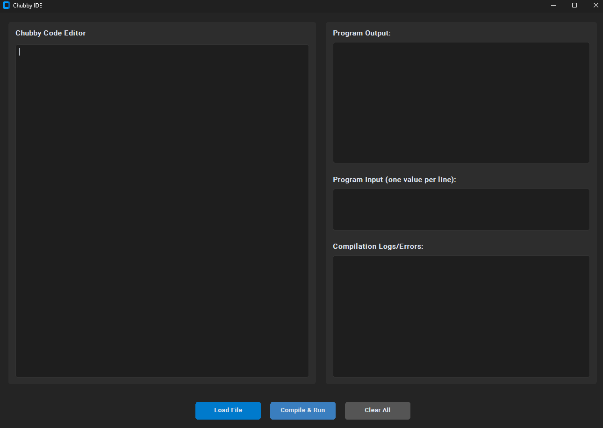

# Chubby - Own Programming Language

An object-oriented programming language with its own compiler and Integrated Development Environment (IDE), developed for the *Compiler Theory and Compilers* university course. This project has transitioned from an initial Java-based implementation to a fully Python-based toolset.

---

## Authors

* **Karol Bystrek** - [karbystrek@student.agh.edu.pl](mailto:karbystrek@student.agh.edu.pl) 
* **Patryk Chamera** - [pchamera@student.agh.edu.pl](mailto:pchamera@student.agh.edu.pl) 

---

## Project Specification

### 1. General Goals
The primary goal of the Chubby project is to design and implement a custom, object-oriented programming language. This endeavor is part of the *Compiler Theory and Compilers* (Teoria Kompilacji i Kompilatory) university course. The process involves defining the language's syntax and semantics, creating grammar, developing a compiler, and exploring key concepts in compilation theory such as lexical analysis, parsing, intermediate code generation, and error handling.

### 2. Translator Type
* **Compiler** 

### 3. Program Output
The ChubbyPython compiler transforms Chubby source code files into **Java source code**. This generated Java code is then automatically compiled into **JVM bytecode** (`.class` files) and executed. The program's output (e.g., from `print` statements) and any compilation or execution errors are displayed within the IDE's designated panels or on the standard output if using the command-line interface.

### 4. Implementation Language
* The Chubby compiler and IDE are implemented in **Python 3**.
* The graphical user interface (IDE) is built using the **CustomTkinter** library.

### 5. Scanner/Parser Implementation Method
* The scanner (lexer) and parser for ChubbyPython are generated using the **ANTLR4** parser generator (Python runtime). 

---

## Token Description

A detailed description of the ChubbyPython language tokens, including their names, literal representations or patterns, and explanations, can be found in the following file:
**[token_description.md](token_description.md)**

---

## Grammar

### 1. Notation
The grammar for the ChubbyPython language is defined using the **ANTLR4** parser generator notation. 

### 2. Grammar Definition
The complete ANTLR4 grammar definition for ChubbyPython is located in the project's `antlr` directory:
**[antlr/Chubby.g4](antlr/Chubby.g4)**

---

## Language Features

Chubby language supports a range of modern programming constructs:

* **Object-Oriented Programming**: Support for classes, constructors, methods, and fields.
* **Access Modifiers**: `public` and `private` visibility for class members.
* **Static Typing**: Type declarations for variables, parameters, and function return values.
* **Primitive Data Types**: `int`, `double`, `long`, `bool`, `char`, `string`, and `void`.
* **Generic `List` Type**: A built-in generic list type (`List<Type>`), which is mapped to `java.util.ArrayList` during compilation.
* **Arrays**: Support for single and multi-dimensional arrays, including declaration and initialization (e.g., `new int[10]` or `int[] a = {1, 2, 3}`).
* **Input/Output**: `print(...)` statement for displaying output and `input(type)` function for reading user input.
* **Control Flow Structures**: `if-then-elsif-else-endif`, `for-in-range-do-endfor`, and `while-do-endwhile`.
* **Comments**: Single-line comments starting with `#`.

---

## IDE Screenshots

**Figure 1:** Main interface of the ChubbyPython IDE.


**Figure 2:** Example of a ChubbyPython program running in the IDE, showing the code editor, input area, and output panel.


---

## Tools, Dependencies, and System Requirements

* **Python**: Version 3.8 or newer is recommended.
* **ANTLR4 Python runtime**: `antlr4-python3-runtime==4.13.0` (installable via pip).
* **CustomTkinter**: For the graphical IDE (installable via pip).
* **Java Development Kit (JDK)**: Required by the ChubbyPython compiler to compile the generated Java source code to JVM bytecode (using `javac`). A version compatible with Java 11+ is recommended.
* **Java Runtime Environment (JRE)**: Required to execute the compiled JVM bytecode (using `java`). Must be compatible with the JDK version used.

---

## Usage Instructions

### 1. Prerequisites
* Ensure you have Python 3 (3.8+) and pip installed.
* Install a compatible JDK and JRE (e.g., OpenJDK 11+ or JDK 21) and verify that `java` and `javac` commands are accessible from your system's PATH.

### 2. Setup & Installation
Clone the repository and install the necessary Python packages:
```bash
git clone https://github.com/karolbystrek/Chubby.git
cd Chubby
pip install -r requirements.txt
```

### 3. Running the ChubbyPython IDE
To launch the Integrated Development Environment:

```bash
python ChubbyIDE.py
```

The IDE allows you to write, edit, compile, and run ChubbyPython code.

### 4. Running via Command Line (CLI)
A basic command-line driver (`Driver.py`) is available for compiling files:

```bash
python Driver.py path/to/your/input_file.txt
```


---

## Example Usage (within the IDE)

1. Start the ChubbyPython IDE: `python ChubbyIDE.py`.
2. Open an existing `.cbb` file (or `.txt` example from `input_examples/`) or paste your ChubbyPython code into the editor. For instance, use the content of `input_examples/test.txt`.
3. If your program uses the `input()` function (like `test.txt`), enter the required input values in the "Program Input (one value per line)" panel. For `test.txt`, you would provide two integers, each on a new line.
4. Click the "Compile & Run" button.
5. Compilation logs will appear in the "Compilation Logs/Errors" panel, and the program's output will be displayed in the "Program Output" panel.

---

## Project Structure

Here is an overview of the most important directories and files in the ChubbyPython project:

```plaintext
ChubbyPython/
├── antlr/
│   ├── Chubby.g4                 # ANTLR4 grammar for ChubbyPython
│   ├── ChubbyLexer.py            # Generated Lexer
│   ├── ChubbyParser.py           # Generated Parser
│   └── ChubbyVisitor.py          # Generated Visitor (base for the compiler)
├── input_examples/
│   ├── quicksort.txt             # Example ChubbyPython source file
│   └── test.txt                  # Another example ChubbyPython source file
├── output/                       # Default directory for generated .java and .class files
│   ├── (ExampleGenerated.java)   # Example of a generated Java file
│   └── (ExampleGenerated.class)  # Example of a compiled Java class file
├── src/
│   ├── ChubbyCompiler.py         # Core compiler logic (parses and translates to Java)
│   ├── JavaBytecodeCompiler.py   # Python wrapper for invoking 'javac'
│   └── JavaBytecodeExecutor.py   # Python wrapper for executing Java bytecode via 'java'
├── tools/
│   └── antlr-4.13.1-complete.jar # ANTLR tool JAR (for regenerating parser/lexer if needed)
├── .gitignore                    # Specifies intentionally untracked files for Git
├── ChubbyIDE.py                  # Main script for launching the ChubbyPython IDE
├── Driver.py                     # Command-Line Interface (CLI) script for the compiler
├── README.md                     # This project documentation file
├── requirements.txt              # Python project dependencies
└── token_description.md          # Detailed description of ChubbyPython language tokens

```
